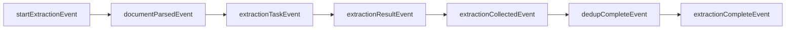
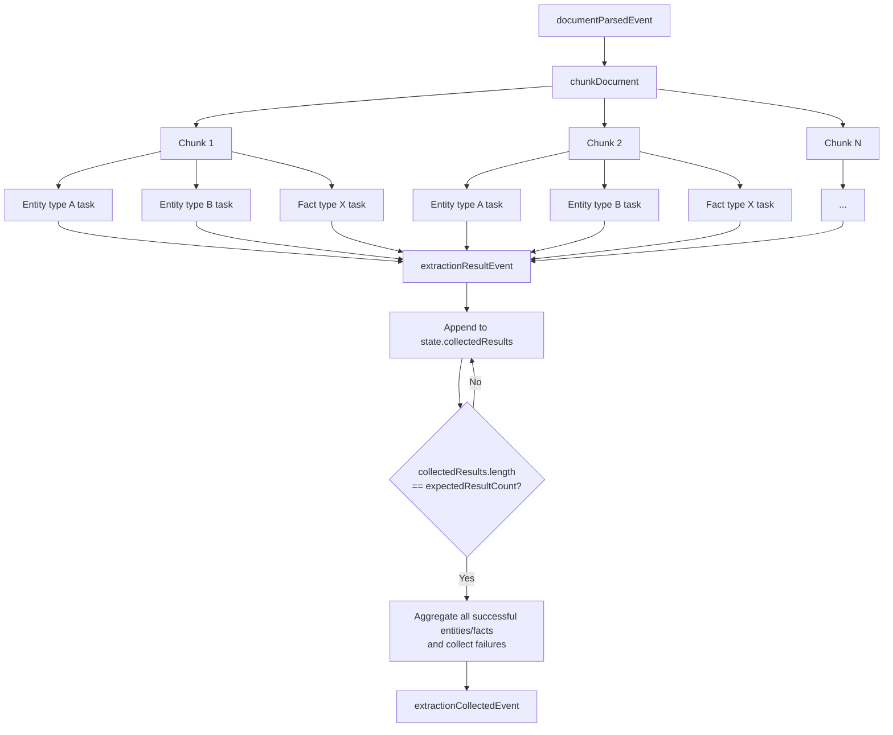

# Document Annotation LlamaIndex Workflow Visualization

Source of truth:
- `src/processing/pipeline/extraction.workflow.ts`
- `src/processing/pipeline/create-extraction-workflow.ts`
- `src/processing/pipeline/workflow-events.ts`

## High-level workflow

```mermaid
flowchart TD
    A[ExtractionWorkflow.run(documentId)] --> B[Load document from Prisma]
    B --> C[Load entity types + fact types from CatalogService]
    C --> D[createExtractionWorkflow()]
    D --> E[workflow.createContext(state)]
    E --> F[startExtractionEvent]

    F --> G[Step 1: parseDocument\nreturns documentParsedEvent]
    G --> H[Step 2: chunkDocument(fullText)]
    H --> I[Compute expectedResultCount\nchunks × (entityTypes + factTypes)]
    I --> J[Fan-out extractionTaskEvent for every\nchunk × entity type × fact type]

    J --> K[Step 3a: extractEntityType]
    J --> L[Step 3b: extractFactType]

    K --> M[extractionResultEvent]
    L --> M
    M --> N[Step 4: collect in state.collectedResults]
    N --> O{All results collected?}
    O -- No --> N
    O -- Yes --> P[Build entities + facts + failures\nreturn extractionCollectedEvent]

    P --> Q[Step 5: deduplicateEntities]
    Q --> R[dedupCompleteEvent]
    R --> S[Step 6: persistResults]
    S --> T{Any failures?}
    T -- Yes --> U[Update document status = partial\nstore error summary]
    T -- No --> V[Skip partial update]
    U --> W[extractionCompleteEvent]
    V --> W

    W --> X[ctx.stream.untilEvent(extractionCompleteEvent)]
    X --> Y[Workflow completes]
```

## Event-level view



## Fan-out / fan-in detail



## Notes

- The workflow uses `withState(createWorkflow())` and stores fan-in state in:
  - `expectedResultCount`
  - `collectedResults`
- Failures in per-type extraction do **not** stop the workflow; they are converted into `extractionResultEvent` objects with an `error` field.
- Persistence always runs with whatever successful results were collected.
- If any extraction task failed, the document is marked `partial` after persistence.
- `chunkReadyEvent` exists in `workflow-events.ts` but is not currently used by `create-extraction-workflow.ts`.
